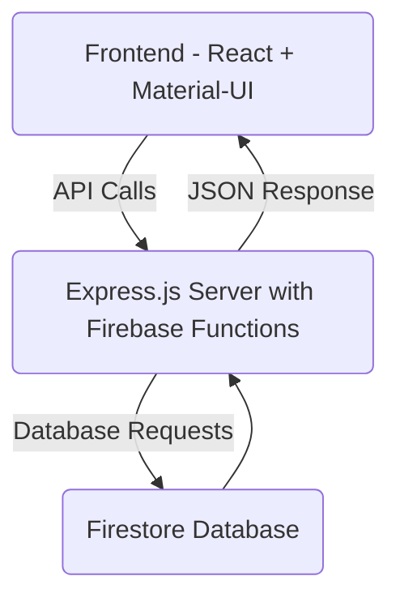

# Technical Documentation: Virtual Labs Question Bank Service

## Table of Contents

- [Introduction](#introduction)
  - [Overview of Service](#overview-of-service)
  - [Purpose and Scope of Documentation](#purpose-and-scope-of-technical-documentation)
- [Architecture and Technologies](#architecture-and-technologies)
  - [Firebase Servies](#firebase-services)
  - [Firebase Services with Express JS](#firebase-services-with-expressjs)
  - [Frontend (React + MaterialUI)](#frontend-react--material-ui)
  - [Architecture Diagram](#architecture-diagram)
- [Installation and System Requirements](#installations-and-system-requirements)
  - [Hardware](#hardware)
  - [Software Dependencies](#software-dependencies)
  - [Installation Steps](#installation-steps)
- [Dependencies](#dependencies)
- [Backend Infrastructure](#backend-infrastructure)
- [API Endpoints and Methods](#api-endpoints-and-methods)
- [Security Measures](#security-measures)
- [Authentication and Authorization](#authentication-and-authorization)
- [Deployment Process](#deployment-process)

## Introduction

### Overview of Service:-
The Virtual Labs Question Bank Service is a Hosted Web and Mobile Application Service that is helpful for Virtual Lab users as well as Teachers/Professors to retrieve questions based on Tag Search and also contribute to service by adding questions.

### Purpose and scope of Technical Documentation:-
The purpose of technical documentation is to provide comprehensive guidance and reference material for developers, administrators, and other stakeholders involved in the development, deployment, and maintenance of a software system or service. It serves as a central source of information that facilitates understanding, implementation, troubleshooting, and continuous improvement of the system.


## Architecture and Technologies

### Firebase Services
- **Authentication:** Used for user authentication and authorization.
- **Hosting:** Used to deploy and host the frontend application.
- **Firestore Database:** Used for storing and retrieving application data in a NoSQL database format.

### Firebase Services with Express.js
- **API Endpoints:** Implemented using Express.js to handle API calls from the frontend and interact with Firebase services.
- **Authentication Middleware:** Secure API endpoints with authentication checks using Firebase Authentication.

### Frontend (React + Material-UI)
- **React Components:** UI components and pages built using React for dynamic user interfaces.
- **Material-UI:** Used for styling components and following Material Design principles.
- **API Integration:** Frontend interacts with Firebase services through API calls to Express.js endpoints.

### Architecture Diagram




## Installations and System Requirements
### Hardware
- Standard hardware requirements for running Node.js applications.

### Software Dependencies
#### For React App:
- Node.js (minimum version specified in package.json)
- npm (Node Package Manager)
- React and its dependencies (listed in package.json)
- Firebase dependencies (e.g., "@firebase/firestore", "firebase")
- Other libraries and packages as listed in package.json

#### For Express Server:
- Node.js (minimum version specified in package.json)
- npm (Node Package Manager)
- Express framework
- Firebase Admin SDK ("firebase-admin")
- CORS package ("cors")

### Installation Steps
#### React App
1. Clone the repository: `git clone https://github.com/your-repo.git`
2. Navigate to the React app directory: `cd your-react-app`
3. Install dependencies: `npm install`

#### Express Server
1. Clone the repository: `git clone https://github.com/your-repo.git`
2. Navigate to the Express server directory: `cd your-express-server`
3. Install dependencies: `npm install`

### Running the Application
#### React App
- Development: `npm start` or `npm run dev`
- Production Build: `npm run build`

#### Express Server
- Start the server: `node server.js`


## API Documentation

### Authentication
Before making any API calls, ensure to include the following headers:
- **Authorization:** Bearer `AccessToken`

### Endpoints

#### GET All Questions
- **Endpoint:** /api/questions
- **Method:** HTTP GET
- **Description:** Retrieve questions from the server based on different parameters.
- **Response Format:** JSON

#### GET Questions by tags
- **Endpoint:** /api/questions?tags=`Enter Tag list here separated by comma` 
- **Method:** HTTP GET
- **Description:** Retrieve only those questions from the server satisfying all specified tags.
- **Parameters:**
  - Example: `/api/questions?tags=physics,biology`
- **Response Format:** JSON

#### GET Questions by Contributor's Email
- **Endpoint:** /api/questions?user=`Enter Contributor EMAIL here` 
- **Method:** HTTP GET
- **Description:** Retrieve only those questions from the database contributed by a particular user.
- **Parameters:**
  - Example: `/api/questions?user=abcd@gmail.com`
- **Response Format:** JSON
 

#### GET Questions by difficulty
- **Endpoint:** /api/questions?difficulty=`Enter difficulty here` 
- **Method:** HTTP GET
- **Description:** Retrieve only those questions from the database of specified difficulty.
- **Parameters:**
  - Example: `/api/questions?difficulty=easy`
- **Response Format:** JSON


#### GET Questions by Multiple Parameters at a time
- **Endpoint:** /api/questions?tags=`Enter Tag list here separated by comma` & user=`Enter Contributor Email` & difficulty=`Enter difficulty` 
- **Method:** HTTP GET
- **Description:** Retrieve only those questions from the server satisfying all parameters
- **Parameters:**
  - Example: `/api/questions?tags=mathematics & user=abcd@gmail.com`
- **Response Format:** JSON

#### GET Question by Question ID:-
- **Endpoint:** /api/questions/:id
- **Method:** HTTP GET
- **Description:** Retrieve only single question. The question ID is the ID of question in FIREBASE
- **Parameters:**
  - Example: `/api/questions/hMtdhXngIOT6ilUZb92q`
- **Response Format:** JSON
- **Response:**
    - Status code 201: returns "success" with the questions retrieved in JSON format under KEY "data" and under key "question"
    - Status code 500: Error retrieving questions due to internal error


- The above RESPONSE code apply to all GET methods above.

#### Create Questions
- **Endpoint:** /api/questions
- **Method:** HTTP POST
- **Description:** Post questions to the database.
- **Request Body Format:** Array of questions in JSON format.
Example:-
  ```json
  [
    {
      "question": "What is the capital of France?",
      "answers": {
        "a":"Paris",
        "b":"Trnindad",
        "c":"Melbourne",
        "d":"Canada",
      },
      "selectedTags": ["physics"],
      "difficulty": "medium",
      "user": "xyz@gmail.com",
      "correctAnswer":4,
      "explanations": {
            "a": "European",
            "b": "European",
            "c": "European",
            "d": "Eurepean"
        }
    },
    {
        "question":"The famous mathematician associated with finding the sum of the first 100 natural numbers is",
        "answers":{
            "a":"Pythagoras",
            "b":"Newton",
            "c":"Gauss",
            "d":"Euclid"
        },
        "selectedTags":["mathematics"],
        "difficulty":"hard",
        "user":"xyz@gmail.com",
        "correctAnswer":3,
        "explanations":{
            "a": "It was Gauss",
            "b": "It was Gauss",
            "c": "Gauss",
            "d": "Gauss"
        }
    }
  ]
  ```
- **Response:**
    - Status code 400: Invalid Question format
    - Status code 200: returns "success" with IDs of the questions created
    - Status code 500: Error creating questions due to internal error


#### DELETE a Question
- **Endpoint:** /api/questions/:id
- **Method:** HTTP DELETE
- **Description:** Delete a question from the database.
- **Parameters:**
  - Example: `/api/questions/hMtdhXngIOT6ilUZb92q`
- **Response Format:** JSON
- **Response:**
    - Status code 200: returns "success" with the question deleted 
    - Status code 500: Error deleting question because ID may be wrong
    - Status code 400: Error as ID not specified


#### UPDATE a Question
- **Endpoint:** /api/questions/:id
- **Method:** HTTP PATCH
- **Description:** Update a question from the database.
- **Parameters:**
  - Example: `/api/questions/hMtdhXngIOT6ilUZb92q`
- **Response Format:** JSON
- **Request Body Format:** Array of questions in JSON format.

Example:-
  ```json
  
    {
      
      "difficulty": "medium",
      "correctAnswer":4,  
    }
    
  ```
the above example updates the values of difficulty and correctAnswer for the question
- **Response:**
    - Status code 200: returns "success" with the question updated 
    - Status code 500: Error deleting question because ID may be wrong
    - Status code 400: Error as ID not specified


## Database and Question Schema

### Description of Database
Currently, there is only one collection in the Firestore database, named `questions`, which contains all the questions.

### Description of Question Schema

Each question in the `questions` collection follows the following JSON schema:

```json
{
  "question": "question string",
  "answers": {
    "a": "string of option A",
    "b": "string of option B",
    "c": "string of option C",
    "d": "string of option D"
  },
  "difficulty": "can be either easy, medium, or difficult",
  "correctAnswer": "can be 1, 2, 3, or 4",
  "selectedTags": ["array", "of", "string", "tags"],
  "user": "contributor email as string",
  "img": "hyperlink of image",
  "explanations": {
    "a": "explanation for option A",
    "b": "explanation for option B",
    "c": "explanation for option C",
    "d": "explanation for option D"
  }
}
```

- Constraints:

   - All fields except img are compulsory and must be non-empty.
   - Every option answer and explanation must be non-empty.


## Backend Infrastructure

- Handles connections to Google Firebase

## Security Measures

### Security Best Practices
- Utilized Firebase SDK for authentication in the React app to ensure secure user authentication.
- Implemented token-based authentication using access tokens to authorize API requests between the frontend and backend.
- Ensured that API calls to the server included the user's access token in the Authorization header for successful requests.
- Used HTTPS to encrypt data in transit and prevent unauthorized access during data transmission.

### Handling Sensitive Information
- Followed best practices for handling sensitive information, such as user data and passwords:
  - Utilized secure storage mechanisms provided by Firebase or other platforms for sensitive data.


### Additional Security Measures
- Enabled Firebase Security Rules to control access to Firestore data based on user authentication and authorization.
- Implemented session management and token expiration mechanisms to revoke access tokens after a certain period or on logout.
- Educated developers and users about security best practices, such as creating strong passwords and recognizing phishing attempts.
- Established a process for incident response and data breach management to quickly address and mitigate security incidents.


## Authentication and Authorization

- Used Firebase Authentication for authentication and authorization of users.
- Implemented token-based authentication using access tokens to authorize API requests between the frontend and backend.
- Also ensured that API calls to the server included the user's access token in the Authorization header for successful requests.

## Secrets

- Google Service Account Key

  - **Location:** `backend/secrets/service-account-key.json`
  - **Purpose:** Used to authenticate the backend with Google Firebase and utilize the service.


## Web Application Code Structure

### Overview

This repository contains the source code for a web application built using React.js for the frontend. The app includes various screens and components to facilitate user interaction, authentication, and data management.

### Code Structure


### Screens Overview

1. **Login/Signup Screen (LoginPage.js)**
   - This screen allows users to log in or sign up for the application.
   - It includes form inputs for email, password, and authentication buttons.
   - Styles for this screen are defined in LoginPageStyles.module.css.

2. **Search Screen (QuestionList.js)**
   - Displays a list of search results or questions based on user input.
   - Provides functionality for filtering and sorting search results.

3. **Question Screen (Quiz.js)**
   - Displays individual questions or quizzes for users to answer.
   - Includes options for selecting answers and displaying correct/incorrect feedback.

4. **Navbar (Navbar.js)**
   - Navigation bar component that appears on all screens for easy navigation.
   - Contains links to different sections of the app and user profile options.

5. **Download Question Screen (downloadlist.js)**
   - Component for downloading question lists or data in a specific format.
   - Allows users to download question data for offline use or analysis.

6. **Add Question Screen (AddQuestion.js)**
   - Interface for adding new questions to the app's database or repository.
   - Includes form inputs for question details, options, and explanations.

7. **Profile Page Screen (profile.js)**
   - User profile page displaying user information, settings, and activity.
   - Allows users to update profile details, change settings, or view activity logs.


## Backend Code Structure


### File and Folder Descriptions

1. **server.js**
   - Entry point to start the backend server.
   - Responsible for initializing the server, setting up routes, and listening for incoming requests.

2. **Route_Handlers**
   - Folder containing route handler files for different HTTP methods (GET, POST, PUT, DELETE).
   - Each file (`delete.js`, `get_multiple.js`, `get_single.js`, `post.js`, `update.js`) handles specific types of requests and interacts with the corresponding data.
   - get_mutiple.js handles API calls for retrieving multiple questions at a time
   - get_single.js handles API calls for retrieving single question at a time 
   - post.js handles API calls for POST requests to service
   - delete.js handles API calls for deleting a question
   - update.js handles API calls for updating a question

3. **Middleware**
   - Folder containing middleware files.
   - `index.js` acts as an authentication middleware, intercepting and processing incoming requests to verify user authentication.

4. **package.json**
   - Configuration file that includes project metadata, dependencies, and scripts.
   - Used for managing project dependencies and running scripts like starting the server.

5. **package-lock.json**
   - Dependency lock file that ensures consistent installations of dependencies across different environments.
   - Automatically generated by npm to lock dependency versions.

6. **secrets**
   - Folder containing sensitive configuration files or credentials.
   - `serviceAccountKey.json` (or similar) is a configuration file for service account credentials, often used for authentication with external services (e.g., Firebase).

This structure organizes the backend codebase into logical components, making it easier to manage routes, middleware, and server configurations separately.


## Testing 


## 


## Deployment Process

[Placeholder: Details about the deployment process are yet to be provided.]

```

```